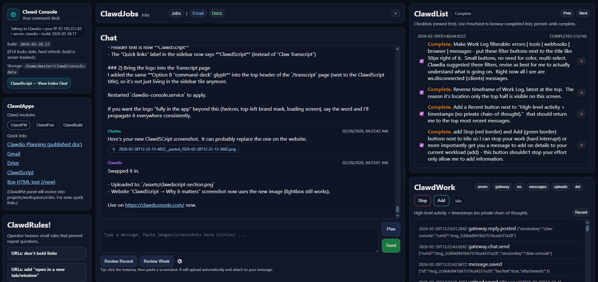

# Clawd Console

Just a better UI for you Clawdmonsters.

**Clawd Console** is an operator cockpit for Clawdbot/Moltbot-style agents.

Most AI UIs are *stateless chat boxes*: you can talk, but you can’t reliably **run** a workflow.
Clawd Console turns an agent into a **builder** with persistent visibility: transcript, artifacts, and an execution checklist that survives context limits and restarts.

## What you get

- **ClawdScript (Transcript):** a durable, searchable record of what happened (messages + artifacts)
- **ClawdList:** a persistent execution checklist extracted from multi-step requests
- **Operator actions:** copy/review/list views built for throughput
- **Artifacts in the trail:** pasted screenshots + uploaded files are first-class
- **Gateway bridge (optional):** connect the UI to a running Clawdbot Gateway session

## Why it matters

LLMs forget. Context windows truncate. Sessions reset.

Clawd Console makes your work **cumulative** by treating the transcript as the truth and by keeping execution state visible.

## Screenshots



More screenshots (marketing site):
- https://clawdconsole.com/

## Quick start (local)

### Requirements
- Node.js 18+ (works on modern Node; tested on Node 22)

### Install
```bash
npm install
```

### Run
```bash
# Minimal
AUTH_PASS="your_password" node index.js

# Or explicitly
PORT=21337 \
DATA_DIR=/path/to/console-data \
AUTH_USER=nwesource \
AUTH_PASS=your_password \
node index.js
```

Open:
- `http://localhost:21337/`

### Environment variables
- `PORT` (default: `21337`)
- `DATA_DIR` (default: `/home/master/clawd/console-data`)
- `AUTH_USER` (default: `nwesource`)
- `AUTH_PASS` (default: empty; **set this in production**)

#### Gateway bridge (optional)
If you’re running a Clawdbot Gateway, the console can bridge messages to it.

- `GATEWAY_WS_URL` (default: `ws://127.0.0.1:18789`)
- `CONSOLE_SESSION_KEY` (default: `claw-console`)

The console will try to read a gateway token from:
- `/root/.clawdbot/clawdbot.json`

## Data files

All files live under `DATA_DIR`:

- `messages.jsonl` — raw message log
- `transcript.jsonl` — compact transcript (“ClawdScript”)
- `dynamic-exec.json` — ClawdList state (active + completed)
- `uploads/` — pasted images / uploaded attachments
- `crm.jsonl` — waitlist leads (if you wire a marketing surface)
- `clawdlist-training.jsonl` — before/after training pairs for improving list extraction

## Security notes

- This server is intended to run **behind authentication**.
- Set `AUTH_PASS`.
- Treat `DATA_DIR` as sensitive (it contains transcripts + attachments).

## Roadmap (near-term)

- Better ClawdList extraction (punctuation-aware, trained on completed lists)
- Adoption metrics page (admin)
- Packaging + install flow for self-hosters
- Optional hosted workspaces (paid convenience)

## License

Apache-2.0
